# OpenSecurityTraining2 Arch1001: Binary Bomb Lab

Ce write-up explore l'exercice Binary Bomb, conçu à l'origine par l'Université Carnegie Mellon pour pour le cours d'architecture de CMU et adapté à l'architecture Intel x86-64 par Xeno Kovah dans le cadre du cours [Architecture 1001 : x86-64 Assembly](https://p.ost2.fyi/courses/course-v1:OpenSecurityTraining2+Arch1001_x86-64_Asm+2021_v1/about) chez [OpenSecurityTraining2](https://ost2.fyi/).
 
Le laboratoire Binary Bomb constitue une immersion dans l'analyse de fichiers binaires et la rétro-ingénierie sous architecture x86-64. L'objectif consiste à désamorcer six phases successives, chacune agissant comme une serrure logique dont la clé est une chaîne de caractères ou une suite de nombres. Toute erreur d'entrée déclenche une fonction d'explosion.

# Sommaire 
- [Configuration](#configuration)
- [Phase 1](#phase-1)
- [Phase 2](#phase-2)
- [Phase 3](#phase-3)
- [Phase 4](#phase-4)
- [Phase 5](#phase-5)
- [Phase 6](#phase-6)

# Configuration
\> Cette analyse est réalisée sous Windows (WinDbg & Visual Studio).

\> `bomb.pdb` permet de charger les symboles, transformant les adresses mémoires brutes en noms de fonctions et de variables explicites.

\> Pour fluidifier le désamorçage, les réponses de chaque phase sont enregistrées dans un fichier texte à raison d'une solution par ligne. En passant ce fichier en argument au binaire (bomb.exe solutions.txt), le programme valide automatiquement les phases déjà résolues.


# Phase 1

Après avoir ouvert `bomb.exe` dans WinDbg et chargé les symboles (`.reload /f`), je défini un breakpoint sur la fonction `main`, puis je parcours les instructions pas à pas jusqu'à ce que le programme me demande de rentrer un input. Je rentre `test` pour observer le comportement, et nous pouvons voir que la suite est un appel à une fonction `phase_1`. 

\> `uf phase_1`pour désassembler la fonction : 
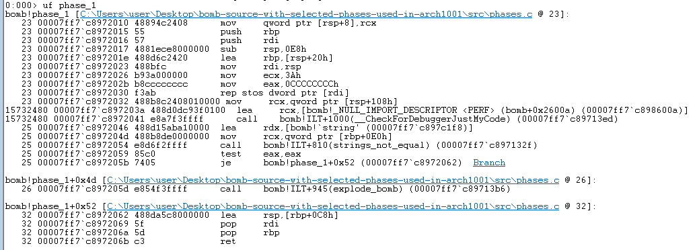

Deux appels de fonction nous intéressent : 

```asm
call    bomb!ILT+810(strings_not_equal) (00007ff7`c897132f)
```
&
```asm
call    bomb!ILT+945(explode_bomb) (00007ff7`c89713b6)
```

Les noms des fonctions étant assez explicite, mais après une rapide vérification, la première compare notre entrée à une autre chaîne de caractère. Si les chaînes ne sont pas égales, le saut amenant à `phase_defused` et `phase_2` est coutourné, et un appel à `explode_bomb` est effecuté. Il faut donc découvrir le contenu à l’adresse où la chaîne est comparée.

En rentrant dans l’appel `strings_not_equal`, je peux vérifier les arguments fournis à la fonction. Dans la convention d'appel de Microsoft x64, l'argument 1 est conservé dans le registre RCX, et l'argument 2 dans le registre RDX. 
Dans WinDBG, on peut afficher la chaine ASCII à ces adresses avec : `da <address>`.

<table style="width: 100%;">
  <tr>
    <td style="width: 50%;">
      <p align="center">
        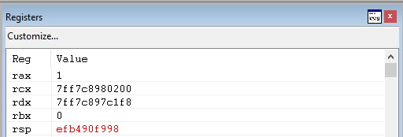
      </p>
    </td>
    <td style="width: 50%;">
      <p align="center">
        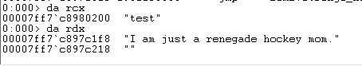
      </p>
    </td>
  </tr>
</table>

`strings_not_equal` compare donc mon input à “I am just a renegade hocky mom.” Comme l'entrée n'est pas égale, voyons ce qui se passe si `explode_bomb` est appelée :

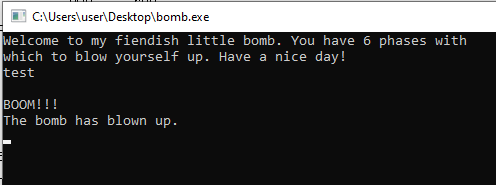

Je peux donc écrire `I am just a renegade hocky mom.` dans la première ligne de mon fichier `solutions.txt` et relancer le programme avec ce dernier en argument. 
Je définis directement notre breakpoint à `phase_2`, et confirme la réussite de cette première phase:

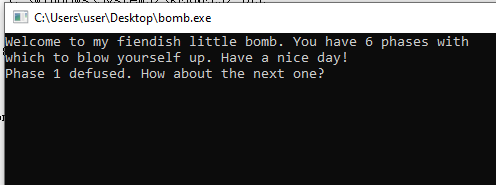

# Phase 2
Comme précédement, je parcours la fonction `phase_2` jusqu'à trouvé un appel intéressant. 
```asm
call    bomb!ILT+205(read_six_numbers) (00007ff7`c89710d2)
```
L'appel à la fonction `read_six_numbers` confirme que le programme attend exactement six arguments entiers. Après avoir désassemblé cette fonction (`uf read_six_numbers`), on remarque l'utilisation de `sscanf` avec un format de chaîne spécifique. 
En utilisant la commande `da 00007ff7c897c460` sur l'adresse chargée dans le registre `rdx`, on peut confirmer le format `%d %d %d %d %d %d`.
```
0:000> da 7ff7c897c460
00007ff7`c897c460  "%d %d %d %d %d %d"
```
La fonction vérifie ensuite que la valeur de retour de sscanf (stockée dans `eax`) est supérieure ou égale à 6 ; dans le cas contraire, la bombe explose immédiatement.

Une fois la lecture validée, le flux d'exécution retourne dans `phase_2` pour la vérification des valeurs. L'analyse pas à pas du désassemblage de `phase_2` (via `uf phase_2`) révèle une structure de contrôle itérative.

Le désassemblage révèle que la validation commence par l'examen du premier élément de la séquence. À l'adresse `00007ff7c89720f0`, l'instruction `cmp dword ptr [rbp+rax+28h], 1` compare la première valeur saisie avec la constante 1. Le registre `rax` ayant été multiplié par zéro juste avant (`imul rax, rax, 0`), il sert d'index initial pour pointer sur le début de notre tableau de nombres en mémoire. Si ce premier nombre diffère de 1, le programme bifurque vers `explode_bomb`.

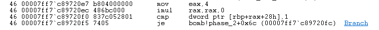

Ensuite, le programme initialise un compteur à 1 (`mov dword ptr [rbp+4], 1`) et entre dans une boucle de vérification. Pour chaque itération, le code compare l'élément actuel avec l'élément précédent transformé. Le mécanisme de calcul se situe entre les adresses `00007ff7c8972113` et `00007ff7c8972129` : Le programme récupère l'index de l'élément précédent (`dec ecx`).La valeur correspondante est chargée dans le registre `ecx`.L'instruction `shl ecx, 1` est appliquée. En architecture x86-64, décaler les bits vers la gauche d'une position revient mathématiquement à multiplier la valeur par deux. Enfin, le programme compare l'élément actuel (`[rbp+rax*4+28h]`) avec ce résultat. Cette structure implique que chaque nombre de la suite doit être le double exact de son prédécesseur. En débutant la séquence par 1, nous obtenons : `1, 2, 4, 8, 16, 32`

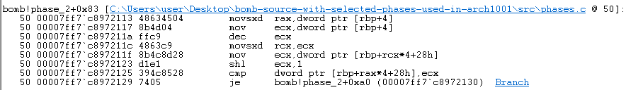

L'inscription de la suite `1 2 4 8 16 32` dans le fichier `solutions.txt` permet de franchir cette étape. En relançant le binaire avec ce fichier en argument et en configurant le breakpoint à `phase_3`, le programme valide automatiquement les deux premières phases et s'immobilise au point d'arrêt de la phase 3, confirmant l'exactitude de l'analyse.

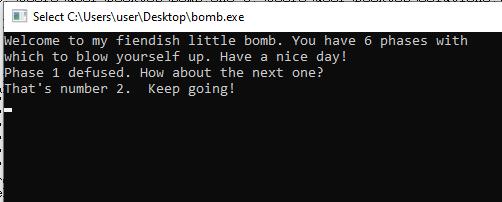

# Phase 3

L'analyse commence par l'identification des entrées attendues. En examinant l'appel à `sscanf` à l'adresse `00007ff7c89721fb`, on remarque que deux arguments sont passés via les registres `r8` et `r9`. L'inspection de la chaîne de format à l'adresse chargée dans `rdx` (`da 00007ff7c897c220`) révèle le masque `%d %d`. Le programme attend donc deux entiers, et vérifie immédiatement que l'utilisateur a bien fourni ces deux valeurs en comparant le résultat de `sscanf` à 2.

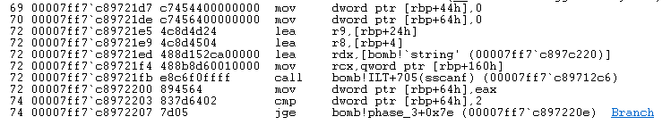

La logique de la phase suivante repose sur le premier nombre saisi, qui sert d'index pour un saut indirect. Le code effectue d'abord une vérification de borne `00007ff7c8972217 : cmp dword ptr [rbp+134h], 7`. Si le premier nombre est strictement supérieur à 7, la bombe explose. Cela restreint les choix valides aux indices compris entre 0 et 7.

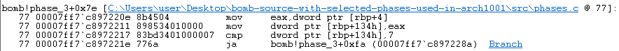

Le calcul de l'adresse de destination est particulièrement intéressant à observer dans WinDbg. Les instructions suivantes :

`movsxd rax, dword ptr [rbp+134h]` : Charge l'index choisi.

`mov eax, dword ptr [rcx+rax*4+122CCh]` : Récupère l'offset correspondant dans la table de saut.

`add rax, rcx` : Calcule l'adresse finale.

`jmp rax` : Effectue le saut vers le "case" correspondant.

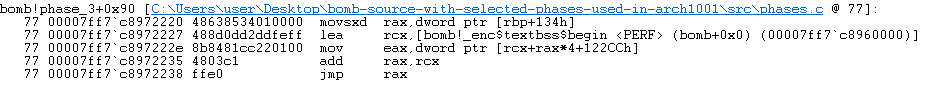

Chaque destination de saut assigne une valeur spécifique à une variable locale (située à `rbp+44h`). Une fois le saut effectué, le flux d'exécution se rejoint à l'adresse `00007ff7c897228f`. À cet endroit, le programme compare le second nombre que nous avons saisi avec la valeur de référence associée à l'index choisi : `cmp dword ptr [rbp+44h], eax`

Pour résoudre cette phase, il suffit d'intercepter l'exécution après le saut :
```
0:000> dd rbp+44h L1
00000037`774ff944  0000025a
```

En choisissant un index valide (par exemple : `0`) et en identifiant la valeur attendue associée (`602` en décimal), on obtient la paire de solutions. J'ajoute donc `0 602` à la troisième ligne du fichier `solutions.txt`. Le programme valide la phase 3 et nous dirige vers la phase 4.

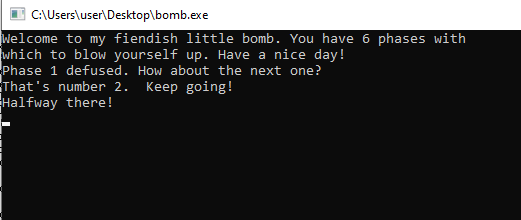

# Phase 4

L'étude débute par l'identification des entrées via l'appel à sscanf à l'adresse `00007ff6dcf823ad`. Le programme attend une paire d'entiers (`%d %d`), le premier étant stocké à l'adresse `rbp+4` et le second à `rbp+24h`. Immédiatement après la lecture, le binaire impose une contrainte de domaine stricte : le premier entier doit être compris entre 0 et 14 (`0xE`). Cette vérification est effectuée par deux instructions `cmp` successives aux adresses `00007ff6dcf823c1` et `00007ff6dcf823c7`. Tout dépassement de cette plage entraîne l'explosion de la bombe.

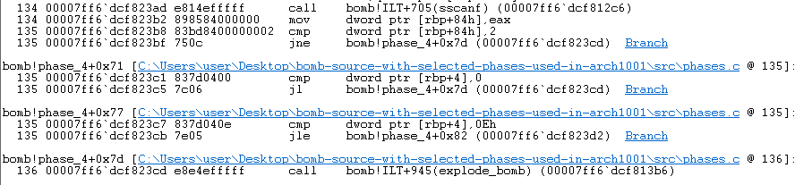

Une fois la validité du domaine confirmée, le programme prépare les arguments pour la fonction `func4` . En respectant la convention d'appel Microsoft x64, les registres sont chargés comme suit : `ecx` reçoit notre premier entier, `edx` est initialisé à 0 (borne inférieure) et `r8d` est fixé à 14 (borne supérieure). 
La première section critique de la fonction calcule le point médian de l'intervalle actuel. Le binaire utilise une séquence d'instructions `sub`, `sar` et `add` pour obtenir le pivot : *mid = low + (high - low) / 2*. Ce pivot, stocké temporairement à l'adresse `rbp+4`, sert de base à la décision récursive et à la valeur de retour.La particularité de cette fonction réside dans son caractère accumulatif. Si l'entrée utilisateur est inférieure au pivot, `func4` s'appelle récursivement sur la moitié inférieure de l'intervalle et ajoute la valeur du pivot actuel au résultat renvoyé par l'appel suivant (`add eax, dword ptr [rbp+4]`). Si l'entrée est supérieure, elle procède de la même manière sur la moitié supérieure. La récursion ne s'arrête et ne renvoie que le pivot seul que lorsque l'entrée est strictement égale à ce dernier.

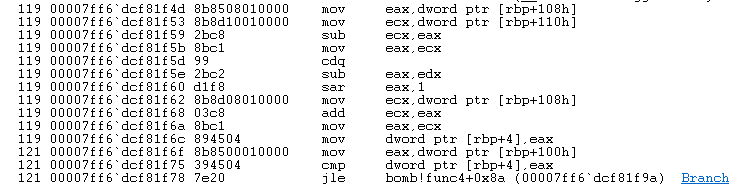

Comme l'illustre la capture ci-dessus, au moment où le breakpoint est frappé pour la deuxième fois, la pile d'appels affiche `bomb!func4` au niveau 00 appelé par lui-même au niveau 01. Le niveau 02 montre l'appel initial provenant de `phase_4+0x99`.

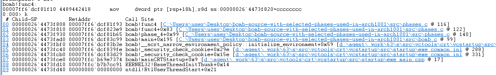

Dans `phase_4`, le succès dépend d'une double condition : le résultat final de `func4` doit être égal à 10 (`0xA`), et notre second entier saisi doit également correspondre à cette valeur. Pour déterminer le premier entier, il est nécessaire de tracer le chemin de l'accumulation. En partant de l'intervalle [0, 14], le premier pivot calculé est 7. Pour obtenir un total de 10, nous devons entrer dans une branche récursive qui retournera 3 (3 + 7 = 10). En analysant la branche inférieure [0, 6], le pivot calculé est 3. Si notre entrée est précisément 3, la fonction s'arrêtera à ce niveau et renverra 3 au premier appel, validant ainsi l'équation 3 + 7 = 10.

En inscrivant la paire 3 10 à la quatrième ligne du fichier solutions.txt, le programme valide la phase. L'exécution automatique confirme que les conditions logiques sont remplies, permettant ainsi d'accéder à la phase suivante.

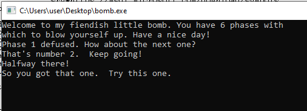

# Phase 5

L'analyse commence par l'appel à `sscanf` à l'adresse `00007ff6dcf824c0`. Le programme attend deux entiers. Le premier est stocké à l'adresse `rbp+64h` et le second à l'adresse `rbp+84h`. Immédiatement après la lecture, le binaire applique un masque binaire sur le premier entier via l'instruction `and eax, 0Fh` à l'adresse `00007ff6dcf824dc`. Cette opération garantit que seule la valeur des quatre bits de poids faible est conservée, limitant l'entrée effective à une plage comprise entre 0 et 15.

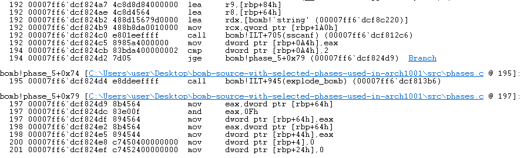

Le binaire entre ensuite dans une boucle itérative dont la structure peut être traduite par l'algorithme suivant :
À chaque itération, le programme utilise la valeur contenue à l'indice i pour déterminer l'indice j de l'itération suivante. Simultanément, un compteur (`rbp+4`) suit le nombre de sauts et un accumulateur (`rbp+24h`) calcule la somme des valeurs rencontrées.
Pour franchir cette phase, deux conditions strictes doivent être remplies à la sortie de la boucle : 
1. Le compteur d'itérations (`rbp+4`) doit être égal à 15. Cela impose de trouver un chemin de saut qui traverse la quasi-totalité du tableau avant d'atteindre la valeur de sortie.
2. L'accumulateur de somme (`rbp+24h`) doit correspondre exactement au second entier saisi (`rbp+84h`).

En inspectant la mémoire à l'adresse du tableau `n1+0x20` via la commande `dd` dans WinDbg, j'ai pu reconstruire la chaîne de sauts en partant de la fin (la valeur de sortie 15 ou `0xF`).

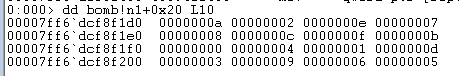

En remontant le tableau à l'envers, la séquence logique de désamorçage est la suivante :
$15 (F) \leftarrow 6 \leftarrow 14 (E) \leftarrow 2 \leftarrow 1 \leftarrow 10 (A) \leftarrow 0 \leftarrow 8 \leftarrow 4 \leftarrow 9 \leftarrow 13 (D) \leftarrow 11 (B) \leftarrow 7 \leftarrow 3 \leftarrow 12 (C) \leftarrow 5$

La solution pour cette phase est le couple d'entiers 5 115. En les ajoutant à la cinquième ligne du fichier solutions.txt, le programme valide la boucle de chaînage et confirme que le compteur et la somme correspondent aux attentes du binaire.

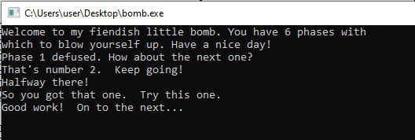

# Phase 6

Cette phase finale débute par une procédure de validation rigoureuse des six entiers fournis par l'utilisateur. L'appel à la fonction `read_six_numbers` à l'adresse `00007ff6dcf8260d` prépare le terrain en stockant les entrées sur la pile, à partir de l'adresse `rbp+48h`. Une fois ces valeurs chargées, le programme engage une série de tests de conformité avant même d'entamer la manipulation de la liste chaînée.

Le premier bloc logique, situé entre les adresses `00007ff6dcf8262c` et `00007ff6dcf82656`, implémente une boucle de contrôle qui itère six fois. À chaque itération, l'index de la boucle (stocké à l'adresse `rbp+0C4h`) est chargé dans le registre `rax` via l'instruction `movsxd`. Le programme accède alors à l'entier correspondant dans notre tableau d'entrée via l'adressage `[rbp+rax*4+48h]`
Deux comparaisons critiques sont alors effectuées :

\> L'instruction cmp ..., 1 suivie d'un saut conditionnel jl vérifie que la valeur n'est pas inférieure à 1.
\> L'instruction cmp ..., 6 suivie d'un saut jle confirme que la valeur n'excède pas 6

Si l'une de ces conditions échoue, le flux d'exécution est dérouté vers explode_bomb. Cette contrainte restreint mathématiquement l'espace des solutions aux chiffres $\{1, 2, 3, 4, 5, 6\}$.

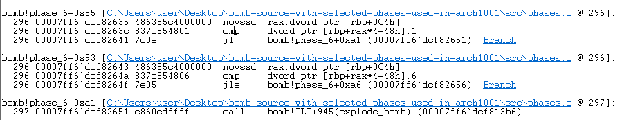

Une fois l'intervalle validé, le binaire exécute une seconde vérification plus sophistiquée destinée à garantir l'unicité de chaque chiffre. Ce mécanisme repose sur une structure de boucles imbriquées située entre les adresses `00007ff6dcf8265e` et `00007ff6dcf8269c`. Le principe est le suivant : pour chaque nombre à l'index i (la boucle externe), le programme initialise une seconde boucle à l'index j = i+1. Il parcourt alors le reste du tableau pour comparer chaque élément ultérieur à l'élément actuel via l'instruction `cmp dword ptr [rbp+rax*4+48h], ecx` à l'adresse `00007ff6dcf8268f`. Si une égalité est détectée (jne non activé), la bombe explose.Cette logique de comparaison assure que l'entrée utilisateur est une permutation unique des chiffres de 1 à 6. Ce n'est qu'après avoir franchi ces deux barrières de sécurité que le programme autorise la transition vers le bloc suivant : la manipulation des nœuds de la liste chaînée.

La particularité de la phase suivante réside dans l'utilisation d'une liste chaînée statique débutant à l'adresse `bomb!node1`. L'exploration de la mémoire avec la commande `dq` (Display Quad-word) dans WinDbg permet de déconstruire la structure interne de chaque nœud. Chaque élément occupe 16 octets : 
- les 4 premiers octets contiennent la valeur numérique (le score),
- les 4 suivants représentent l'ID du nœud (de 1 à 6),
- les 8 octets restants constituent le pointeur vers le nœud suivant.

Comme le montre la capture ci-dessus, j'ai parcouru manuellement la liste en suivant les pointeurs successifs. Le nœud n°1 (0x212) pointe vers l'adresse ...f040, qui contient le nœud n°2, et ainsi de suite jusqu'au nœud n°6 qui pointe vers NULL.

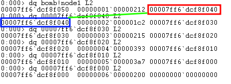


| **Nœud (ID)** | **Valeur (Hex)** | **Valeur (Décimal)** | **Adresse du suivant** |
| ------------- | ---------------- | -------------------- | ---------------------- |
| **1**         | `0x212`          | **530**              | `...f040`              |
| **2**         | `0x1c2`          | **450**              | `...f030`              |
| **3**         | `0x215`          | **533**              | `...f020`              |
| **4**         | `0x393`          | **915**              | `...f010`              |
| **5**         | `0x3a7`          | **935**              | `...f000`              |
| **6**         | `0x200`          | **512**              | `0x000` (Fin)          |


Le programme utilise les six nombres saisis comme un nouvel ordre pour réorganiser les pointeurs de la liste. Après cette restructuration, une boucle finale (située à l'adresse `00007ff6dcf827a3`) parcourt la nouvelle liste pour vérifier une condition critique : chaque nœud doit posséder une valeur supérieure ou égale à celle du nœud suivant.

Le binaire exige donc que nous réordonnions les nœuds par ordre décroissant de leurs valeurs numériques.

En classant les valeurs identifiées précédemment du plus grand au plus petit (935 > 915 > 533 > 530 > 512 > 450), nous obtenons la séquence d'ID suivante : 5 4 3 1 6 2.

L'ajout de cette suite dans le fichier solutions.txt désamorce la sixième phase. Le programme affiche alors le message de félicitations, confirmant que la "bombe" a été intégralement neutralisée.

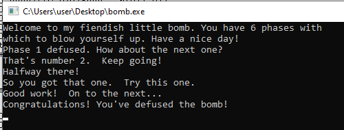
